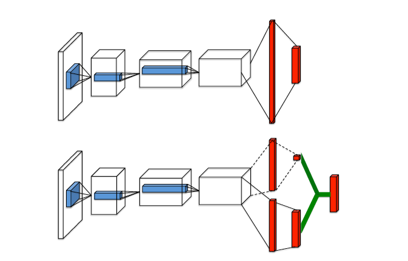

# Dueling DDQN

This code implemented dueling network architecture [1].


Dueling network architecture represents two separate estimators: one for the state value function, and one for the advantage function.

Test environment: `Enduro-v0`
- observation space: `Box(210, 160, 3)`
- action space: `Discrete(9)`


A trained agent (dueling DDQN) is playing the game:


### Instructions
* `buffer.py` stores transitions collected at each step and reuse them for training
* `model.py` defines the dueling network architecture
* `agent.py` defines (double) DQN agent

Option 1: let a trained agent play
```python
python3 watch.py
```
Option 2: follow the instructions in `notebook/solve_Enduro.ipynb` to train ag agent

### Implement Details
In `Enduro-v0` environment, the observation is an RGB image of the screen, which is an array of shape `(210, 160, 3)`. The preprocess step turns each RGB image into a grey frame with shape `(1, 80, 80)`. Two frames are stacked together as one input to the networks. By doing this, time-dependent features (e.g. speed, direction, etc.) can be captured.


## References
[1] Z. Wang, T. Schaul, M. Hessel, H. Van Hasselt, M. Lanctot, and N. De Freitas.  Dueling network architectures for deep reinforcement learning.arXiv preprint arXiv:1511.06581, 2015.
